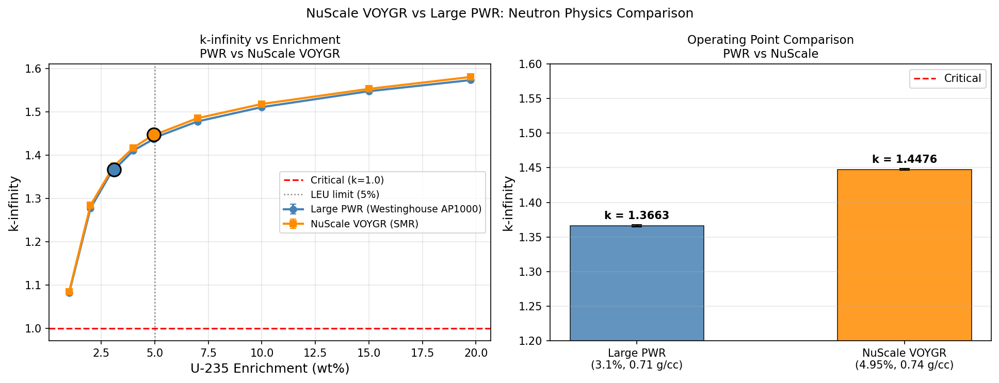
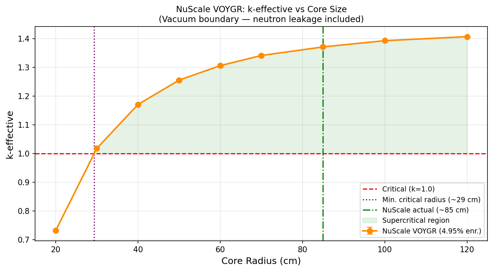
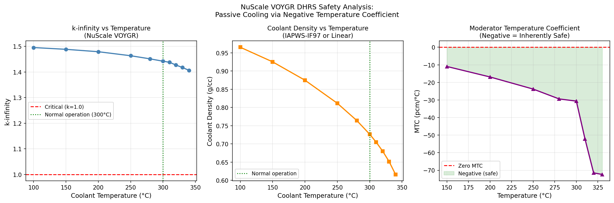
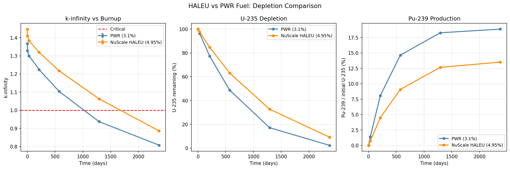

# OpenMC NuScale VOYGR SMR Study

Monte Carlo neutron transport simulations of NuScale VOYGR SMR using OpenMC 0.15.3.  
Conducted as part of a computational nuclear engineering portfolio for PhD applications.

## Environment

- OpenMC 0.15.3 (conda-forge)
- Nuclear data: ENDF/B-VIII.0 HDF5
- Python 3.11 / WSL2 Ubuntu

## Simulations

### 1. NuScale vs PWR Comparison (`nuscale_vs_pwr.py`)
Pin cell k-infinity comparison between Large PWR and NuScale VOYGR.

| Design | Enrichment | Coolant Density | k-infinity |
|--------|------------|-----------------|------------|
| Large PWR (AP1000) | 3.10% | 0.71 g/cc | 1.366 ± 0.001 |
| NuScale VOYGR | 4.95% | 0.74 g/cc | 1.448 ± 0.001 |

**Finding:** Higher enrichment in NuScale provides +0.082 excess reactivity,  
enabling sufficient fuel life in a compact core.

---

### 2. Critical Size Search (`critical_size.py`)
k-effective vs core radius for NuScale VOYGR — finding minimum critical size.

| Core Radius (cm) | k-effective | Status |
|-----------------|-------------|--------|
| 20 | 0.732 ± 0.002 | ❌ Subcritical |
| 30 | 1.018 ± 0.002 | ✅ Critical |
| 85 | 1.371 ± 0.002 | ✅ NuScale actual |
| 120 | 1.406 ± 0.001 | ✅ Supercritical |

**Finding:** Minimum critical radius ~29 cm (0.59 m diameter).  
NuScale's actual 85 cm core provides 2.9× safety margin over minimum critical size,  
ensuring sufficient fuel life, power output, and shutdown margin.

---

---

### 3. DHRS Passive Safety Analysis (`dhrs.py`)
Moderator Temperature Coefficient (MTC) calculation confirming NuScale's passive safety.

| Temperature (°C) | Coolant Density (g/cc) | k-infinity | MTC (pcm/°C) |
|-----------------|----------------------|------------|--------------|
| 100 | 0.965 | 1.495 ± 0.001 | — |
| 300 | 0.727 | 1.442 ± 0.001 | -30.65 |
| 320 | 0.680 | 1.427 ± 0.001 | -71.48 |
| 340 | 0.616 | 1.407 ± 0.001 | — |

**Finding:** MTC is negative across entire operating range (100–340°C).  
Temperature rise of +40°C causes -1,752 pcm reactivity reduction,  
confirming NuScale DHRS passive safety without pumps or external power.

---

---

### 4. HALEU vs PWR Depletion Comparison (`haleu_depletion.py`)
Burnup analysis comparing NuScale VOYGR (4.95% HALEU) vs Large PWR (3.1%).

| Time (days) | PWR k-eff | NuScale k-eff | PWR U-235 (%) | NuScale U-235 (%) |
|-------------|-----------|---------------|---------------|-------------------|
| 0 | 1.368 | 1.446 | 100% | 100% |
| 571 | 1.104 | 1.218 | 48.7% | 63.1% |
| 1,291 | 0.937 ❌ | 1.063 ✅ | 17.2% | 32.7% |
| 2,371 | 0.808 ❌ | 0.887 ❌ | 2.3% | 9.2% |

**Key findings:**
- PWR reaches criticality limit at ~1,100 days (~3 years)
- NuScale HALEU remains critical ~700 days longer (~2 extra years of fuel life)
- NuScale produces less Pu-239 (13.5% vs 18.9%) → lower proliferation risk

---

## References

- NuScale FSAR (Publicly available NRC Design Certification Document)
- OpenMC Documentation: https://docs.openmc.org
- ENDF/B-VIII.0 Nuclear Data Library
